# COM 验证流程周报：方法论、数据处理与结果展示

日期：2026-06-04  
项目目录：`H:\COM\video-vicon`  
当前主线：`keypoints-preprocessed` 分支，即 `video_keypoints-preprocessed/results/keypoints_and_com_preprocessed.json`

## 1. 本周工作目标

本项目的核心目标是验证视频推断得到的 2D center of mass (CoM) 是否能在步行 trial 中复现 Vicon gold standard 的 CoM 变化趋势。这里的“验证”不是直接证明视频 2D 指标已经等价于完整 3D 生物力学指标，而是检查：

1. 视频 CoM 与 Vicon CoM 在同一时间轴上是否有相似波形。
2. 视频关键点预处理和平滑后，CoM 轨迹是否更稳定。
3. 由视频 CoM 派生的 displacement、velocity、l、xCoM 等指标，在 WT02 这类示例 trial 中与 Vicon 投影结果是否一致。
4. 当前误差主要来自哪里，为下一轮方法改进提供依据。

## 2. 数据与当前产物

### 2.1 输入数据

| 类型 | 路径 | 作用 |
|---|---|---|
| Vicon raw CSV | `video-vicon/data/Chenzixuan/Vicon/rawdata/Chenzixuan_20260505_test/*.csv` | Vicon gold standard，包含 `Model Outputs` 中的 `:CentreOfMass` |
| Video/Vicon manifest | `video-vicon/data/Chenzixuan/Video/video_trial/Video_ViconTrial_manifest.csv` | 记录 trial 名称、Vicon frame 范围、采样率、duration、视频 offset |
| Active video JSON | `video-vicon/data/Chenzixuan/Video/video_keypoints-preprocessed/results/keypoints_and_com_preprocessed.json` | 当前视频 CoM 输入，包含预处理后的 COCO-17 keypoints、`com`、`source_com` |

### 2.2 输出数据

| 输出 | 路径 | 内容 |
|---|---|---|
| CoM 相关性 | `video-vicon/validation/com_keypoints_preprocessed/com_correlation.csv` | 每个 trial 的水平/垂直轴 Pearson、nRMSE、xcorr peak、lag |
| CoM z-score 图 | `video-vicon/validation/com_keypoints_preprocessed/com_z-score_detrend_xcorr/*.png` | 每个 trial 每个轴的 detrend + z-score 后波形对比 |
| 视频指标 CSV | `video-vicon/validation/metrics_keypoints_preprocessed/video_com_metric.csv` | 视频 CoM、scale、displacement、velocity、l、xCoM |
| Vicon 指标 CSV | `video-vicon/validation/metrics_keypoints_preprocessed/vicon_com_metric.csv` | Vicon CoM、displacement、velocity、l、xCoM |
| WT02 全帧指标验证 | `video-vicon/validation/metrics_keypoints_preprocessed/metrics_timeseries_validation_WT02/` | WT02 在 Vicon 时间轴上的 metric comparison |
| WT02 逐帧可视化 | `video-vicon/validation/metrics_keypoints_preprocessed/video_metrics_WT02_first100/` 和 `vicon_metrics_WT02_first100/` | 视频/Vicon 对齐帧 overlay 与路径 overview |

### 2.3 数据规模

| 指标 | 数值 |
|---|---:|
| trial 数 | 13 |
| manifest 中 Vicon trial 总时长 | 34.112 s |
| active video metric 行数 | 1028 |
| Vicon metric 行数 | 8001 |
| WT02 全帧验证重叠样本数 | 954 个 Vicon-time samples |

13 个 trial 包括：`WT02`, `WT06`, `WT07`, `WT08`, `WT09`, `WT10`, `WTFAST11`, `WTFAST14`, `WTFAST18`, `WTFAST19`, `WTFAST20`, `WTFAST21`, `WTFAST22`。

## 3. 完整方法流程

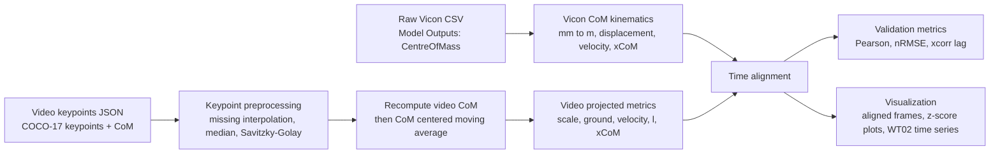

流程可以分为六步：

1. 从 Vicon raw CSV 读取 gold standard CoM。
2. 对视频 keypoints 做 trial-wise 预处理，并保留可追溯字段。
3. 基于预处理 keypoints 重新计算视频 CoM，并生成视频 2D 投影指标。
4. 基于 Vicon CoM 生成 Vicon kinematic 指标。
5. 按用途选择时间对齐方法。
6. 输出 CSV、相关性图、逐帧 overlay 图和 WT02 全帧 time-series 图。

## 4. 坐标系与时间轴原则

### 4.1 坐标系

项目中有两个坐标系统：

| 数据源 | 坐标 | 说明 |
|---|---|---|
| Video | 2D pixel 坐标，原点左上，`y` 向下 | 当前视频指标是 2D 投影，不是真正 3D CoM |
| Vicon | 3D lab 坐标，单位 mm，`Z` 为垂直方向 | gold standard |

front/back 视角下，视频 2D 只能与 Vicon 的 Y-Z 投影比较：

| Video 轴 | 对应 Vicon 轴 | 含义 |
|---|---|---|
| video `x` | Vicon `Y` | 水平方向，且当前可视化中 Vicon Y 做镜像以匹配视频走路方向 |
| video `y` | Vicon `Z` | 垂直方向，注意视频 y 向下，Vicon Z 向上 |

### 4.2 时间轴

项目中有三条时间轴：

1. 原始 iPhone 视频时间轴。
2. 剪切后的 trial 视频时间轴。
3. Vicon trial frame 时间轴。

不能把视频第 1 帧直接等同于 Vicon 第 1 帧。以 WT02 为例，当前对齐图中的第一组配对是：

```text
video frame 6,  t=0.167s  <->  Vicon frame 298, t=0.168s
```

对应文件名中也编码了配对关系和时间差：

```text
WT02_aligned_video_idx_01_video_0006_vicon_0298_dt_1.3ms.png
```

### 4.3 两种对齐方法不能混用

| 用途 | 方法 | 是否插值 | 输出 |
|---|---|---:|---|
| 逐帧图像示例 | 对每个视频帧找 nearest-time Vicon frame | 否 | side-by-side / overlay 图、文件名配对 |
| CoM / metric 相关性 | 把视频指标线性插值到 Vicon `time_s` | 是 | Pearson、nRMSE、xcorr lag |

当前 CoM z-score 相关性使用方向是：`video -> Vicon time axis`。即先裁剪到视频/Vicon 时间重叠区间，再对每个 Vicon 时间点 `t_vicon` 估计视频值：

```text
video(t_vicon) = video0 + (video1 - video0) * (t_vicon - t0) / (t1 - t0)
```

插值后，video 和 Vicon 有相同的 Vicon-time samples，因此 xcorr lag 以 Vicon frame 报告，再按 250 Hz 转换为毫秒：

```text
lag_ms = lag_frames / 250 * 1000
```

## 5. Vicon CoM 指标计算

Vicon CoM 读取自 CSV 的 `Model Outputs` section，列名以 `:CentreOfMass` 结尾，原始单位为 mm。

### 5.1 单位转换

```text
com_m = [com_x_mm, com_y_mm, com_z_mm] / 1000
```

### 5.2 位移

位移为相邻 Vicon frame 之间的 CoM 差分：

```text
dr_i = r_i - r_(i-1)
dr_0 = [0, 0, 0]
displacement_m = norm(dr_i)
```

### 5.3 速度

Vicon 速度用时间上的数值梯度计算：

```text
velocity = gradient(com_m, time_s)
velocity_m_s = norm(velocity)
```

### 5.4 xCoM

当前假设 Vicon ground height 为 `Z = 0`：

```text
l(t) = com_z_m(t)
omega0(t) = sqrt(9.81 / l(t))
xCoM(t) = CoM(t) + velocity(t) / omega0(t)
```

前后视角的 2D Vicon 图使用 Y-Z 投影：

```text
Y (m, mirrored)
Z (m)
```

## 6. Video CoM 与投影指标计算

### 6.1 关键点预处理

当前 active JSON 来自：

```text
video-vicon/data/Chenzixuan/Video/video_keypoints-preprocessed/results/keypoints_and_com_preprocessed.json
```

预处理顺序：

1. 按 trial 分组。
2. 对每个 COCO-17 keypoint 的 x/y 坐标分别处理。
3. 缺失值线性插值，端点用最近有效值延拓。
4. median filter，window = 3。
5. Savitzky-Golay filter，window = 7，polyorder = 2。
6. 用预处理后的 keypoints 重新计算 CoM。
7. `source_com` 保留 CoM smoothing 之前的 CoM，`com` 为当前 active 输入 CoM。

### 6.2 CoM smoothing

CoM 在像素空间做 centered moving average：

```text
com_smoothing_method = centered_moving_average
com_smoothing_window = 5
```

这一步的目的不是改变原始记录，而是降低 frame-to-frame CoM 抖动对 velocity 和 xCoM 的放大。

### 6.3 视频尺度估计

当前视频尺度使用每帧左右肩宽：

```text
reference_shoulder_width_m = 0.34
shoulder_width_px = norm(left_shoulder - right_shoulder)
pixels_per_meter = shoulder_width_px / 0.34
```

### 6.4 地面高度估计

视频图像 y 轴向下，因此左右踝中 y 更大的点更靠近画面下方：

```text
ground_y_px = max(left_ankle_y_px, right_ankle_y_px)
```

### 6.5 位移

视频位移基于相邻视频帧 CoM pixel displacement，而不是对绝对坐标 `com_px / pixels_per_meter(t)` 直接求导：

```text
dx_px = com_x_px_i - com_x_px_(i-1)
dy_px = com_y_px_i - com_y_px_(i-1)

displacement_x_m = dx_px / pixels_per_meter_i
displacement_y_m_up = -dy_px / pixels_per_meter_i
displacement_m = sqrt(displacement_x_m^2 + displacement_y_m_up^2)
```

这样做是为了避免每帧变化的 `pixels_per_meter(t)` 重缩放图像原点，制造人工速度。

### 6.6 速度

视频速度基于 frame-to-frame displacement：

```text
velocity_x_m_s = displacement_x_m * VIDEO_FPS
velocity_y_m_s_up = displacement_y_m_up * VIDEO_FPS
velocity_m_s = sqrt(velocity_x_m_s^2 + velocity_y_m_s_up^2)
```

当前 `VIDEO_FPS = 29.996`。

### 6.7 Video xCoM

```text
l_px = ground_y_px - com_y_px
l_m = l_px / pixels_per_meter
omega0 = sqrt(9.81 / l_m)

com_x_m = com_x_px / pixels_per_meter
com_y_m_up = -com_y_px / pixels_per_meter

xcom_x_m = com_x_m + velocity_x_m_s / omega0
xcom_y_m_up = com_y_m_up + velocity_y_m_s_up / omega0

xcom_x_px = xcom_x_m * pixels_per_meter
xcom_y_px = -xcom_y_m_up * pixels_per_meter
```

## 7. 验证指标

### 7.1 CoM shape correlation

对 CoM 相关性，当前流程是：

1. 裁剪视频和 Vicon 的时间重叠区间。
2. 将视频 CoM 插值到 Vicon `time_s`。
3. 做坐标方向匹配：video x vs Vicon Y，video y vs Vicon Z。
4. 两路信号分别做 linear detrend。
5. 两路信号分别做 z-score normalization。
6. 计算 Pearson r、p-value、nRMSE。
7. 计算 xcorr peak 和 lag。

### 7.2 WT02 all-frame metric validation

WT02 全帧验证同样将视频指标插值到 Vicon 时间轴，然后比较：

| metric | video column | Vicon column |
|---|---|---|
| velocity | `video_velocity_m_s` | `vicon_velocity_yz_m_s` |
| l | `video_l_m` | `vicon_l_m` |
| CoM horizontal displacement | `video_com_x_delta_m` | `vicon_com_x_delta_m` |
| CoM vertical displacement | `video_com_y_delta_m` | `vicon_com_y_delta_m` |
| xCoM horizontal displacement | `video_xcom_x_delta_m` | `vicon_xcom_x_delta_m` |
| xCoM vertical displacement | `video_xcom_y_delta_m` | `vicon_xcom_y_delta_m` |

## 8. 结果展示

### 8.1 跨 trial CoM 相关性

跨 13 个 trial 的 CoM shape correlation 如下。这里比较的是 detrend + z-score 后的波形相似度，而不是绝对幅值。

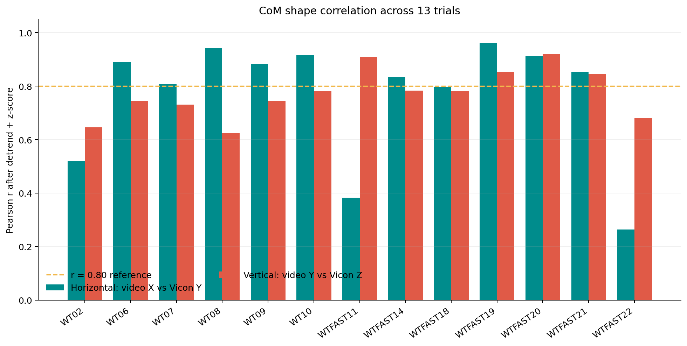

总体结果：

| 方向 | mean Pearson r | median Pearson r | mean xcorr peak | mean nRMSE |
|---|---:|---:|---:|---:|
| Horizontal: video x vs Vicon Y | 0.766 | 0.854 | 0.820 | 0.622 |
| Vertical: video y vs Vicon Z | 0.773 | 0.780 | 0.798 | 0.660 |

表现较好的结果包括：

| trial | axis | Pearson r | xcorr peak | lag |
|---|---|---:|---:|---:|
| WTFAST19 | horizontal | 0.961 | 0.961 | 0 ms |
| WT08 | horizontal | 0.942 | 0.970 | -52 ms |
| WTFAST20 | vertical | 0.920 | 0.922 | -4 ms |
| WT10 | horizontal | 0.915 | 0.951 | -52 ms |
| WTFAST20 | horizontal | 0.913 | 0.916 | -12 ms |

需要重点回看的视频包括：

| trial | axis | Pearson r | xcorr peak | lag | 可能问题 |
|---|---|---:|---:|---:|---|
| WTFAST22 | horizontal | 0.264 | 0.521 | 760 ms | 水平趋势/尺度/关键点质量异常 |
| WTFAST11 | horizontal | 0.383 | 0.585 | -960 ms | xcorr lag 很大，可能存在时间或波形问题 |
| WT02 | horizontal | 0.519 | 0.539 | -56 ms | 水平方向受前进趋势和 2D 投影影响较大 |

### 8.2 WT02 CoM z-score / xcorr 示例

WT02 水平方向：

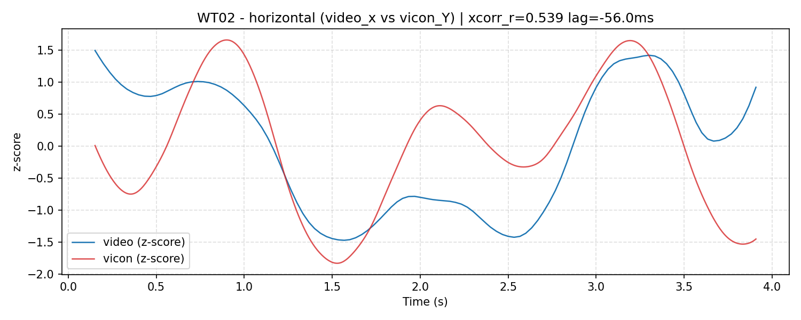

结果：

| trial | axis | Pearson r | xcorr peak | lag |
|---|---|---:|---:|---:|
| WT02 | horizontal: video x vs Vicon Y | 0.519 | 0.539 | -56 ms |

WT02 垂直方向：

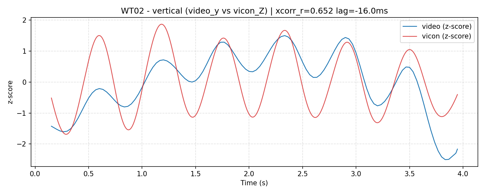

结果：

| trial | axis | Pearson r | xcorr peak | lag |
|---|---|---:|---:|---:|
| WT02 | vertical: video y vs Vicon Z | 0.646 | 0.652 | -16 ms |

解释：WT02 垂直方向比水平方向更稳定。水平方向更容易受到前进趋势、2D 投影和每帧尺度估计变化影响。

### 8.3 WT02 视频与 Vicon 逐帧可视化

逐帧图用于检查 overlay 是否合理、配对文件名是否反映正确的 video/Vicon 时间对应关系。注意：逐帧图使用 nearest-time Vicon frame，不是相关性分析中的插值数据。

视频第一个 aligned frame：

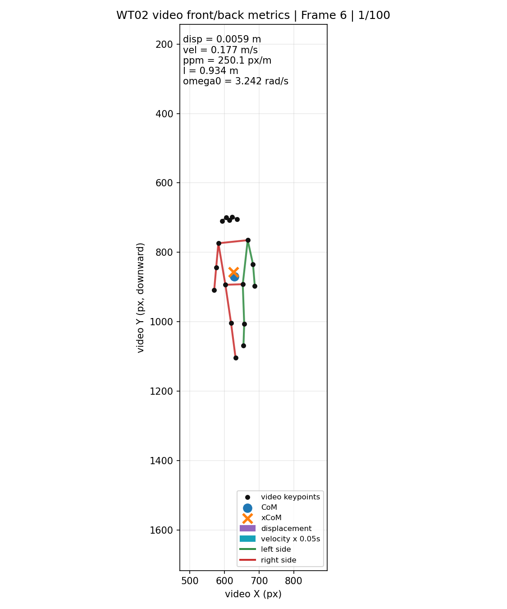

Vicon 对应 frame：

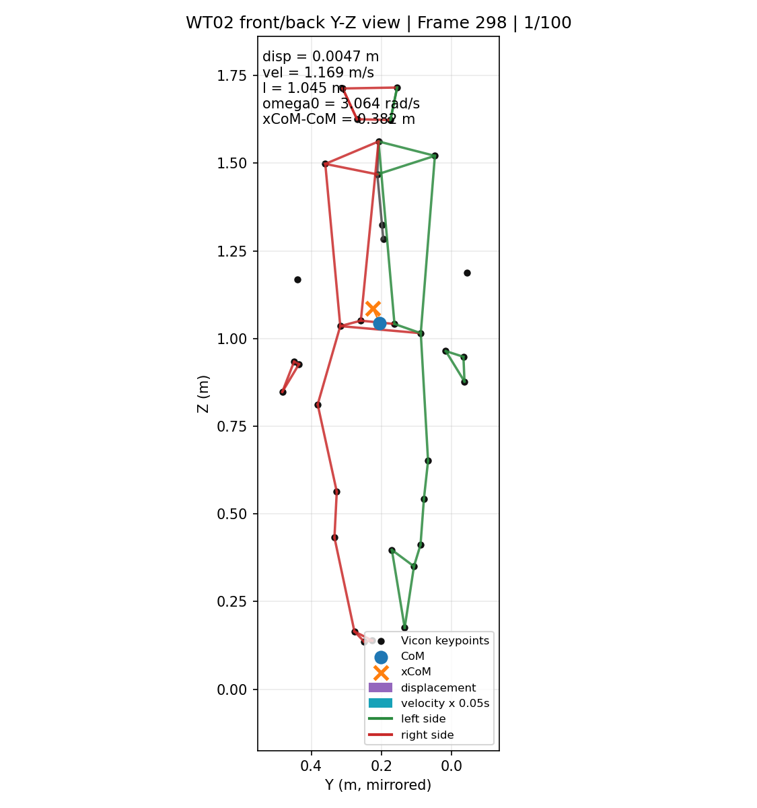

视频 first100 CoM/xCoM path overview：

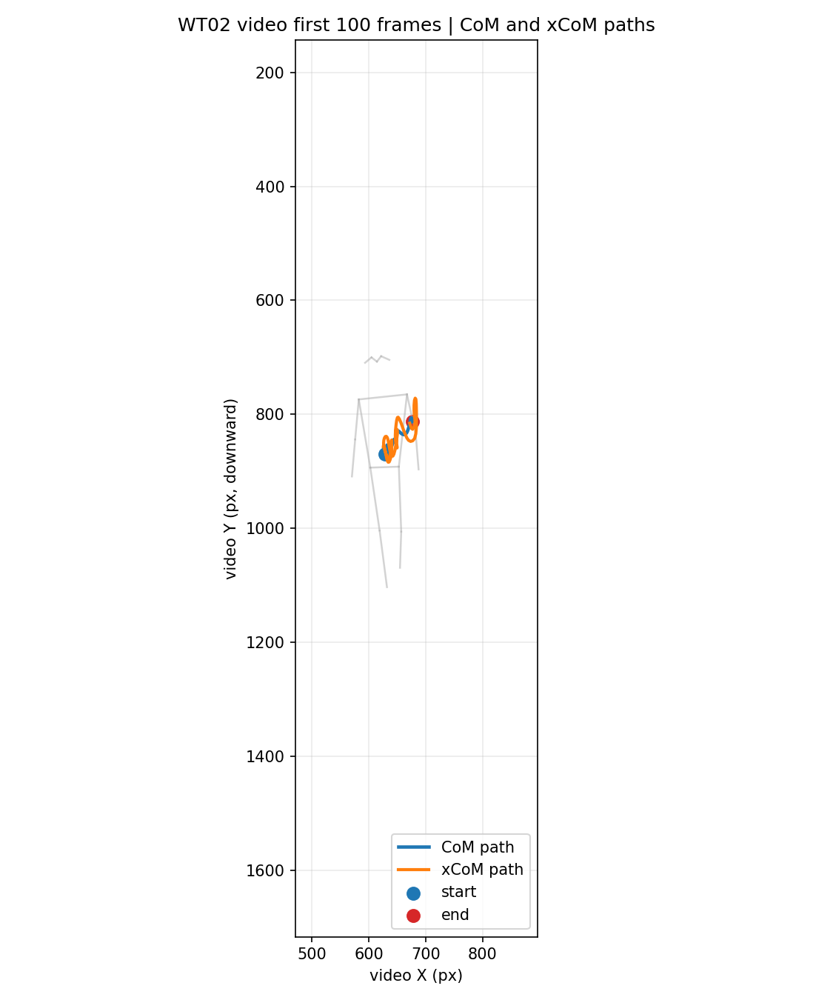

Vicon Y-Z CoM/xCoM path overview：

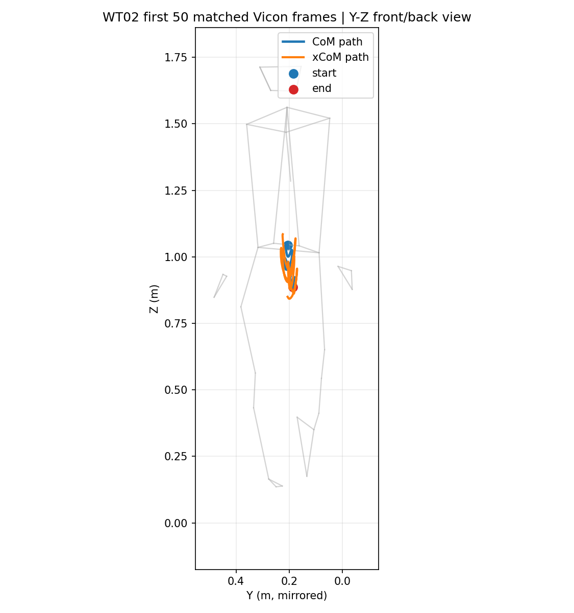

颜色约定：

| 颜色 | 含义 |
|---|---|
| green | 左侧 limb / marker |
| red | 右侧 limb / marker |
| black dots | keypoints / markers |
| blue dot | CoM |
| orange x | xCoM |
| purple | displacement |
| cyan | velocity × 0.05 s |

### 8.4 WT02 all-frame metric correlation

WT02 全帧指标验证使用 954 个 Vicon-time samples。结果图如下：

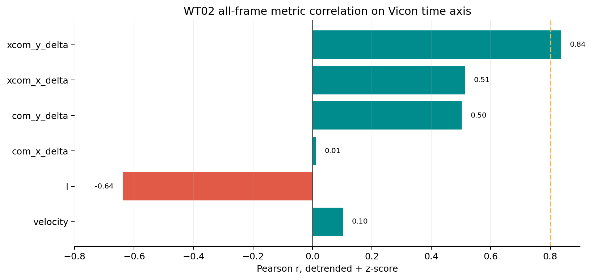

数值结果：

| metric | raw Pearson r | detrend + z-score Pearson r | nRMSE detrend + z-score | xcorr peak | lag |
|---|---:|---:|---:|---:|---:|
| velocity | 0.140 | 0.103 | 1.340 | 0.781 | -300 ms |
| l | -0.382 | -0.639 | 1.810 | 0.676 | 868 ms |
| com_x_delta | -0.454 | 0.011 | 1.407 | 0.473 | 864 ms |
| com_y_delta | -0.963 | 0.502 | 0.998 | 0.618 | -604 ms |
| xcom_x_delta | -0.175 | 0.513 | 0.987 | 0.621 | -100 ms |
| xcom_y_delta | -0.710 | 0.835 | 0.574 | 0.836 | 4 ms |

当前最强结果是 `xcom_y_delta`：detrend + z-score 后 Pearson r = 0.835，xcorr peak = 0.836，lag = 4 ms。  
当前较弱结果是 velocity：raw r = 0.140，detrend + z-score r = 0.103，说明视频速度仍然受噪声和尺度影响较大。

### 8.5 WT02 velocity time series

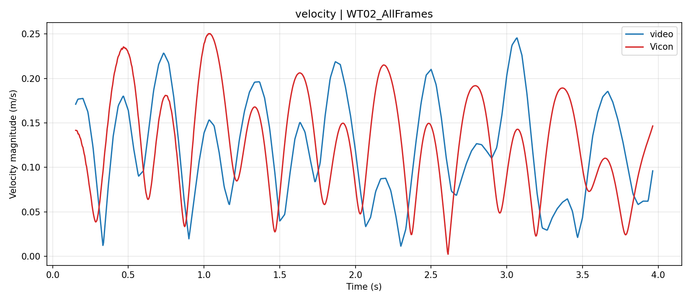

观察：velocity 波形有一定周期性，但视频速度比 Vicon 更容易出现高频抖动。原因是速度由位移乘以 FPS 得到，小的 CoM/keypoint 抖动会被放大。

### 8.6 WT02 l time series

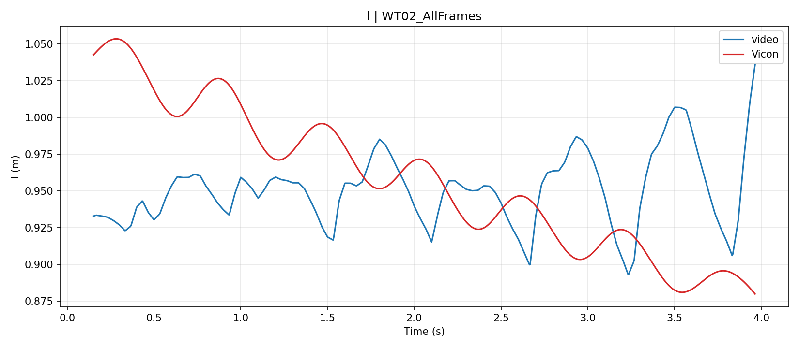

观察：`l` 依赖 CoM 到 ground 的距离。当前 ground 由左右踝 y 的最大值估计，走路时左右脚交换可能导致 ground 估计跳变。

### 8.7 WT02 CoM displacement

原始 CoM displacement 对比：

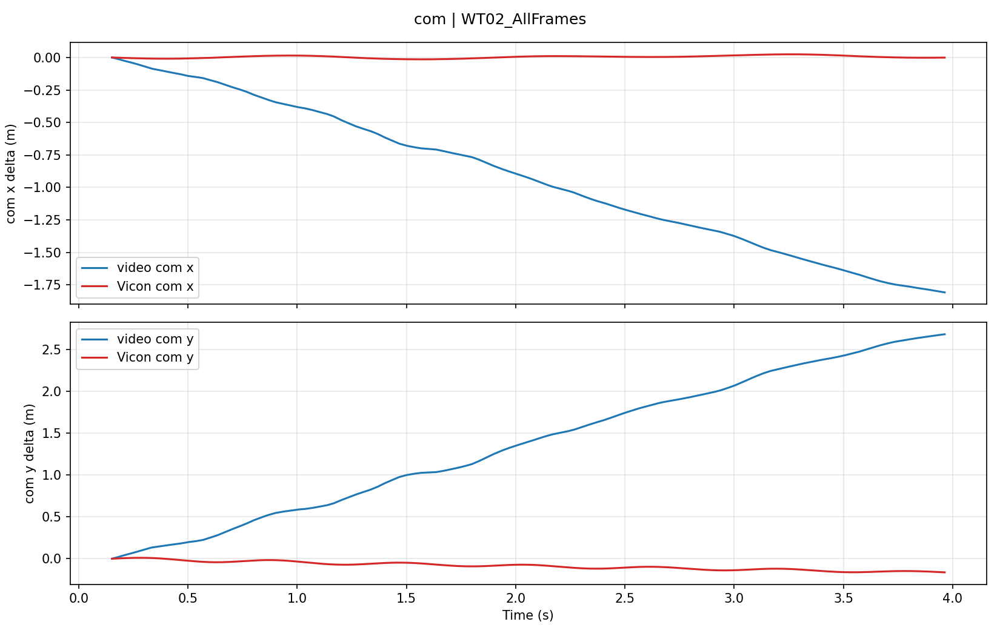

去线性趋势后的 CoM displacement 对比：

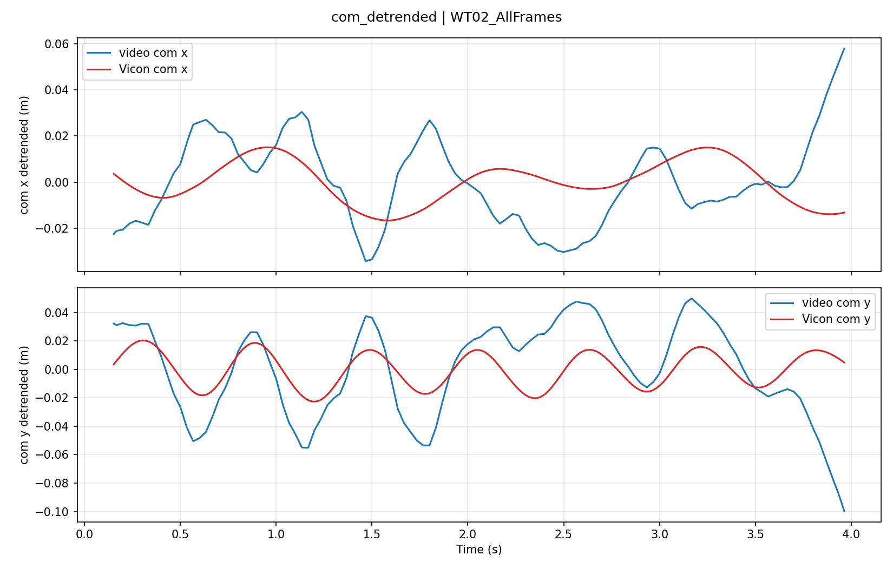

按 xcorr lag 裁剪后的 CoM displacement 对比：

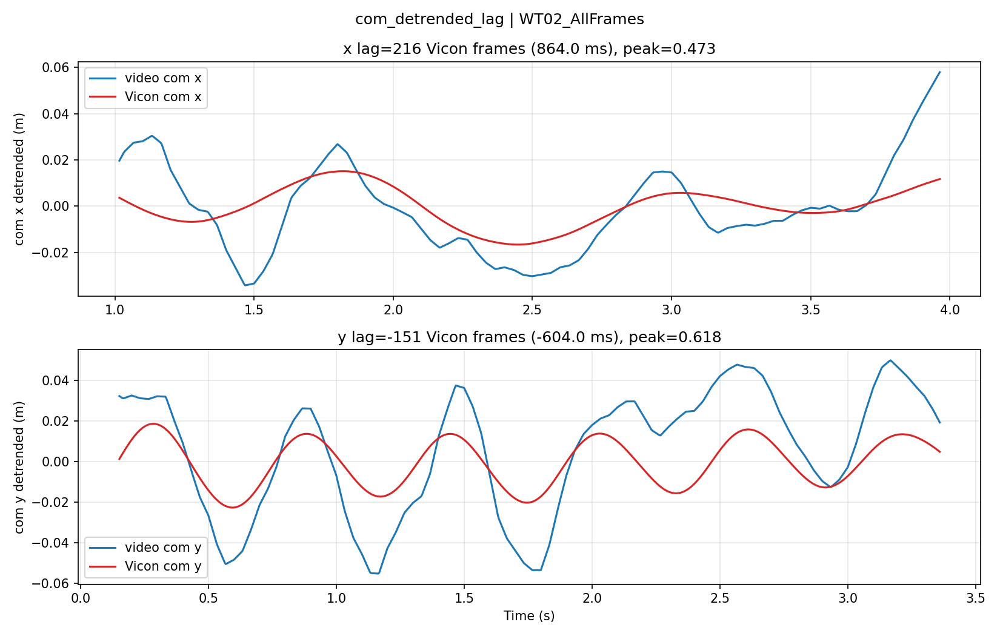

观察：CoM 水平方向仍有明显不一致，竖直方向周期性相对更清楚。水平轴更容易受到整体前进趋势和 2D 投影限制影响。

### 8.8 WT02 xCoM displacement

原始 xCoM displacement 对比：

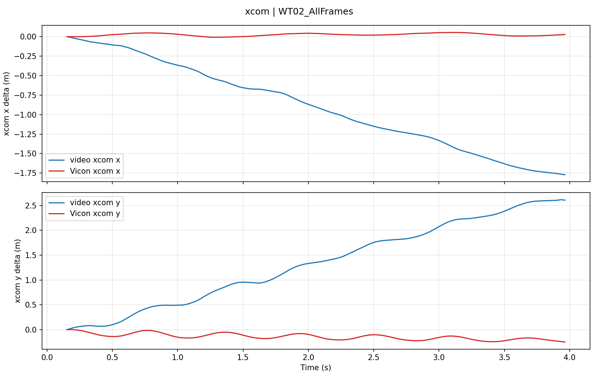

去线性趋势后的 xCoM displacement 对比：

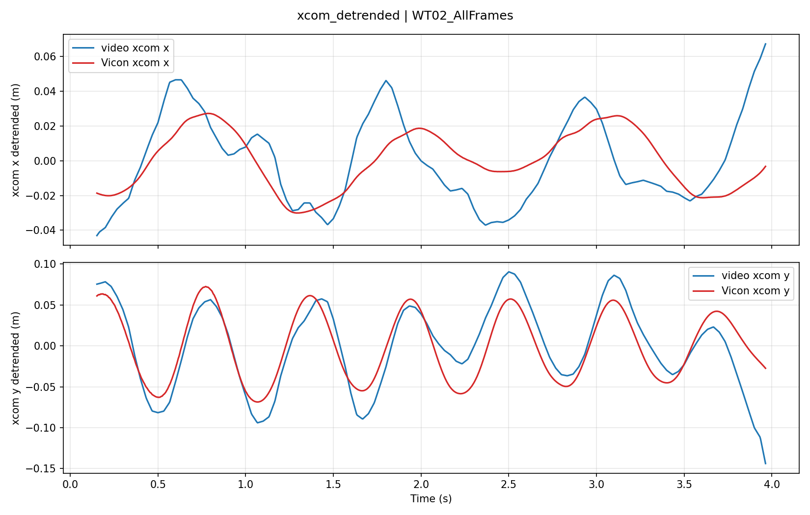

按 xcorr lag 裁剪后的 xCoM displacement 对比：

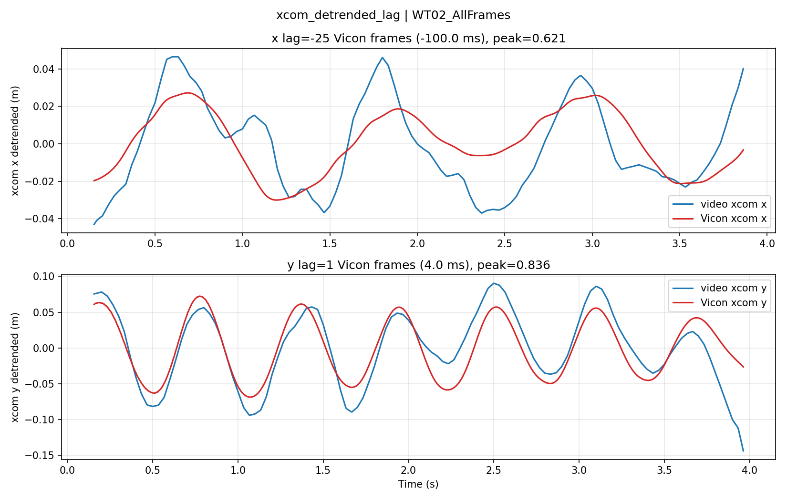

观察：`xcom_y_delta` 是 WT02 当前最强的派生指标，去趋势后与 Vicon 的波形匹配较好，并且 lag 接近 0。

## 9. 当前问题与误差来源

视频指标仍然明显比 Vicon 噪声更大，不能直接作为最终 validated biomechanics metric。主要原因包括：

### 9.1 pixels_per_meter 每帧变化

当前尺度来自每帧肩宽：

```text
pixels_per_meter = shoulder_width_px / 0.34
```

肩部关键点检测轻微抖动会导致 `pixels_per_meter(t)` 帧间变化，进而影响：

1. CoM 从 pixel 到 meter 的换算。
2. displacement。
3. velocity。
4. l。
5. xCoM。

其中 velocity 和 xCoM 对这个误差最敏感。

### 9.2 ground_y_px 可能换脚

当前 ground 估计：

```text
ground_y_px = max(left_ankle_y_px, right_ankle_y_px)
```

走路过程中，左右脚交替支撑。如果左右踝检测有噪声，`max()` 可能在两只脚之间频繁切换，导致 `l` 和 xCoM 不稳定。

### 9.3 速度放大关键点误差

视频速度基于 30 Hz frame-to-frame 位移。即使 CoM 抖动只有几个像素，乘以 FPS 后也会变成明显的速度噪声。

### 9.4 2D 投影限制

视频是 2D 投影，Vicon 是 3D。front/back 视角下只能比较视频 X/Y 与 Vicon Y/Z 投影，不能解释为完整 3D CoM 或完整 3D velocity。

## 10. 下一步建议

下一轮建议先不要直接改公式，而是系统比较误差来源：

1. **raw video CoM vs smoothed video CoM**  
   评估 CoM smoothing window 对波形、速度和 xCoM 的影响。

2. **raw pixels_per_meter vs smoothed pixels_per_meter**  
   对 shoulder-width scale 做 median 或 low-pass smoothing，检查 velocity 是否明显改善。

3. **raw ground_y_px vs stance-foot / smoothed ground estimate**  
   避免 `max(left_ankle_y, right_ankle_y)` 在左右脚之间抖动切换。

4. **视频帧间隔匹配的 Vicon 指标**  
   不直接比较 Vicon 250 Hz frame-to-frame displacement 与视频 30 Hz frame-to-frame displacement，而是把 Vicon 聚合到相同视频帧间隔后比较。

5. **保留 raw 与 filtered 输出分离**  
   所有新结果写入独立目录，保留原始 CSV/JSON，便于审计和回溯。

## 11. 汇报口径

建议周报中使用以下表述：

> 当前工作已经打通 video keypoints-preprocessed 到 Vicon gold standard 的完整验证流程。跨 trial CoM shape correlation 整体达到约 0.77 的平均 Pearson r，说明视频 CoM 在多个 trial 中能复现一部分 Vicon CoM 波形。WT02 的 xCoM 竖直方向派生指标在去趋势后表现较好，但 velocity、水平 CoM 和 l 仍受尺度抖动、ground 估计和 2D 投影影响明显。因此当前阶段应定位为 validation pipeline 与误差来源分析阶段，而不是最终 biomechanical metric 定量结论。

